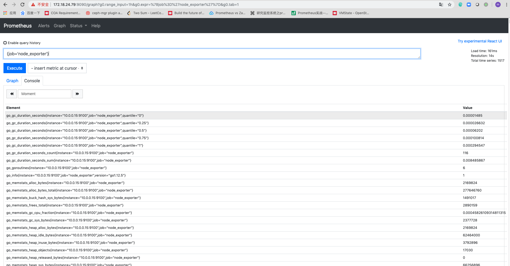
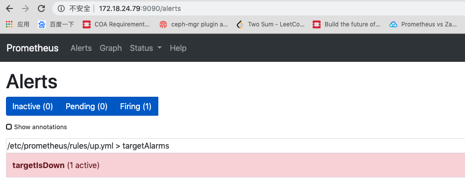
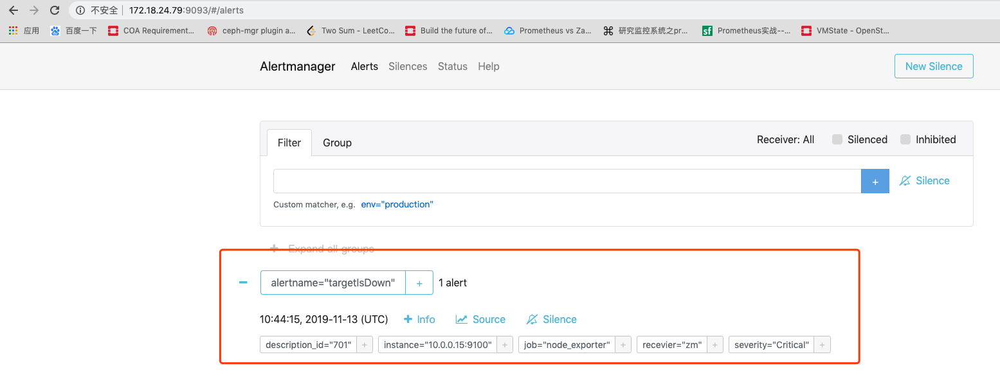
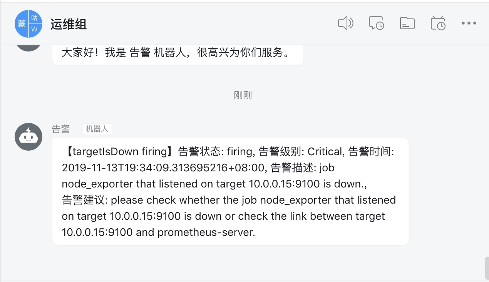
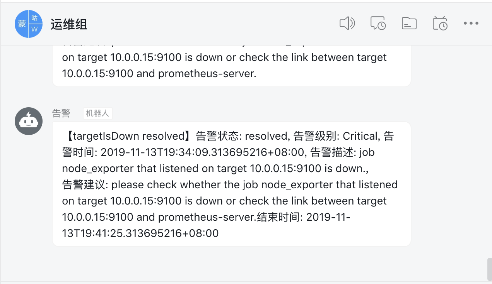

# 搭建 prometheus 监控报警系统

## What is Prometheus?

### promrtheus 简介
  Prometheus是一个由SoundCloud构建的开源监控告警系统,自2012年成立以来，许多公司和组织都采用了Prometheus.它现在是一个独立的开源项目，独立于任何公司维护。2016年Prometheus加入CNCF(Cloud Native Computing Foundation)，成为继Kubernetes之后的第二个托管项目。它的源码托管在github：https://github.com/prometheus/prometheus.git

### prometheus 架构

首先来一张官方给出的架构图：


**prometheus监控系统各个模块是如何默契合作的?**

  1. Prometheus server 定期从静态配置的 targets 或者服务发现的 targets 拉取数据。
  2. 当新拉取的数据大于配置内存缓存区的时候，Prometheus 会将数据持久化到磁盘（如果使用 remote storage 将持久化到云端）。
  3. Prometheus 可以配置 rules，然后定时查询数据，当条件触发的时候，会将 alert 推送到配置的 Alertmanager。
  4. Alertmanager 收到警告的时候，可以根据配置，聚合，去重，降噪，最后发送警告。
  5. 可以使用 API， Prometheus Console 或者 Grafana 查询和聚合数据。

**本篇文章将根据架构图中圈出的几点搭建出一个简易的prometheus监控报警系统**

- jobs/exporters: 用于抓取监控数据，本篇文章以node-exporter为例
- prometheus-server: TSDB，收集obs/exporters的监控数据，然后根据告警规则触发告警， 将告警发送给alertmanager
- alertmanager： 接收prometheus-server端发送的告警，进行分组、去重等操作后发送告警通知。
- prometheus-alertmanager-dingtalk: 接收alertmanager发送的告警通知，将告警通知格式化(遵循钉钉机器人webhook要求的数据格式)后通知给钉钉机器人

## node-exporter 部署

**dockerhub node-exporter镜像:** [prom/node-exporter](https://hub.docker.com/r/prom/node-exporter/tags)

启动node-exporter. 注意根据自己的环境替换address和port.

```
[root@queens1 ~]# docker run -d -p 9100:9100 --net=host --restart=always --name node_exporter -v /etc/localtime:/etc/localtime:ro -v /:/host:ro,rslave -v /var/lib/node_exporter:/var/lib/node_exporter:z prom/node-exporter:latest --path.rootfs /host --collector.filesystem --collector.cpu --collector.meminfo --web.listen-address 10.0.0.15:9100
```

查看 node-exporter 是否正常启动

```
# 检查node_exporter是否运行
[root@queens1 ~]# docker ps |grep node_exporter
9ed57ed3db08        prom/node-exporter:latest                              "/bin/node_exporter -"   6 minutes ago       Up 6 minutes                            node_exporter
# 检查是否抓取到相应数据。 由于数据较多， 这里不展示了
[root@queens1 ~]# curl http://10.0.0.15:9100/metrics
```

## alertmanager 部署

**dockerhub alertmanager镜像:** [prom/alertmanager](https://hub.docker.com/r/prom/alertmanager/tags)

### 编辑alertmanager配置文件

可自行创建/etc/container/alertmanager/alertmanager.yml

```
---
global:
  resolve_timeout: 5m
  http_config:
    tls_config:
      insecure_skip_verify: true
route:
  group_by: [alertname]
  group_wait: 1s
  group_interval: 10s
  repeat_interval: 1h
  receiver: 'web.hook'
  routes:
    - receiver: 'web.hook'

receivers:
  - name: 'web.hook'
    webhook_configs:
      # 这里是我们后面要用到的prometheus-alertmanager-dingtalk对应的url. alertmanager将把告警通知推送到这个url. 
      - url: 'http://127.0.0.1:8060/'
        send_resolved: true
inhibit_rules:
  - source_match:
      severity: 'Critical'
    target_match:
      severity: 'Warning'
    equal: ['alertname', 'instance']
```

启动 alertmanager. 注意根据自己的环境替换address和port.

```
[root@queens1 ~]# docker run -d -p 9093:9093 --net=host --restart=always --name alertmanager -v /etc/localtime:/etc/localtime:ro -v /etc/pki:/etc/pki:ro -v /etc/container/alertmanager:/etc/alertmanager prom/alertmanager:latest --config.file /etc/alertmanager/alertmanager.yml --web.listen-address 10.0.0.15:9093 --cluster.listen-address 10.0.0.15:9094 --cluster.peer 10.0.0.15:9094
```

浏览器访问alertmanager. 由于我的部署环境是一台云主机，因此我需要访问floating ip: http://172.18.24.79:9093. 注意替换为自己环境的地址.


## prometheus-server 部署

**dockerhub prometheus-server镜像:** [prom/prometheus](https://hub.docker.com/r/prom/prometheus/tags). 我这里选择最新的镜像。

```
# 拉取镜像
[root@queens1 ~]# docker pull prom/prometheus:latest
```

### 编辑prometheus配置文件.

可以自行创建/etc/container/prometheus/prometheus.yml. 下面给出示例

```
global:
  # scrape_interval: 默认prometheus -server从target抓取监控数据的时间间隔, 各job如果配置了这个选项，则该值会被覆盖
  scrape_interval: 15s
  # evaluation_interval: prometheus 评估告警规则的时间间隔
  evaluation_interval: 2s

# 配置告警规则文件目录.
rule_files:
  - /etc/prometheus/rules/up.yml

scrape_configs:
  - job_name: 'prometheus'
    # 覆盖global中的scrape_interval
    scrape_interval: 180s
    # 抓取数据的超时时间
    scrape_timeout: 10s
    static_configs:
      # 配置prometheus-server url
      - targets:
          - "10.0.0.16:9090"

  - job_name: 'node_exporter'
    # 覆盖global中的scrape_interval
    scrape_interval: 2s
    static_configs:
      # node_exporter url
      - targets:
          - "10.0.0.16:9100"

# Alertmanager配置项
alerting:
  alertmanagers:
    - scheme: http
      static_configs:
        # alertmanger url
        - targets:
          - "10.0.0.16:9093"
```

### 编辑告警规则

可自行创建/etc/container/prometheus/rules/up.yml. `up`用于监控所有prometheus jobs的链接状态. 断开持续15s则触发告警.

```
---
groups:
  - name: targetAlarms
    rules:
      - alert: targetIsDown
        # promQL query 表达式成立时触发告警
        expr: up == 0
        # 表达式成立持续时间，这里设置为持续15s,告警状态由pending-->firing. 若不设置for，表达式成立则告警状态直接为firing
        for: 15s
        labels:
          severity: Critical
          description_id: 701
        annotations:
          description: >-
            job {{ $labels.job }} that listened on target {{ $labels.instance }} is down.
          summary: >-
            job {{ $labels.job }} that listened on target {{ $labels.instance }} is down.
          suggestion: >-
            please check whether the job {{ $labels.job }} that listened on target
            {{ $labels.instance }} is down or check the link between target
            {{ $labels.instance }} and prometheus-server.
          resource_type: virtual.prometheus
          sub_resource_type: target
          alert_target: "{{ $labels.instance }}"
          alert_target_id: "{{ $labels.serialnumber }}"
```

### 启动prometheus-server

```
[root@queens1 ~]# docker run -d -p 9090:9090 --net=host --restart=always --name prometheus -v /etc/localtime:/etc/localtime:ro -v prometheus:/prometheus:rw -v /etc/container/prometheus:/etc/prometheus:ro prom/prometheus:latest --config.file /etc/prometheus/prometheus.yml --storage.tsdb.path /prometheus --storage.tsdb.retention.time 15d --web.listen-address 10.0.0.15:9090
```

浏览器访问prometheus-server， 由于我的部署环境是一台云主机，因此我需要访问floating ip: http://172.18.24.79:9090. 注意替换为自己环境的地址.


查询监控数据，我们可以在输入框输入查询query。这里以{job='node_exporter'}为例，查询node_exporter抓取的监控数据



查看配置的target jobs： http://172.18.24.79:9090/targets. 可以看到我们prometheus.yml中配置的prometheus和node_exporter都是up状态


## 篇中测试

down 掉 node-exporter

```
[root@queens1 ~]# docker stop node_exporter
```

浏览器查看promeheus是否产生告警. http://172.18.24.79:9090/alerts. 注意替换为自己的地址.

我们看到prometheus已经触发告警



浏览器查看alertmanager是否产生告警.



start node_exporter 检查告警是否消除。 步骤参考上述告警测试，这里不再演示。

## 篇中总结

至此，我们已经完成了告警数据的抓取(node-exporter)，收集存储和告警触发(prometheus-server)，告警分组以及去重等(alertmanager), 那么alertmanager如何去通知到运维人员的。下面我们演示如何将告警通知到钉钉.

## 获取机器人webhook

### 了解钉钉机器人的安全设置

钉钉机器人只能在群组中创建，所以我们可以创建一个群，用于接收告警通知。这里我的群名称为‘运维组’。

为安全着想，钉钉提供了三种安全设置。在创建机器人时至少要选择一种。

- 自定义关键词： 消息中至少包含其中1个关键词才可以发送成功，最多10个关键词
- 加签：timestamp+"\n"+密钥当做签名字符串，使用HmacSHA256算法计算签名，然后进行Base64 encode，最后再把签名参数再进行urlEncode，得到最终的签名（需要使用UTF-8字符集）
- IP地址（段）：只有来自IP地址范围内的请求才会被正常处理

下面我们将以第二种‘加签’进行演示

### 创建钉钉机器人

注意要把下图的‘加签’保存下来。

 

### 保存webhook

 

### 加签方式

#### 计算签名

 ```python
import time
import hmac
import hashlib
import base64
import urllib

def generate_signature(secret):
    timestamp = long(round(time.time() * 1000))
    secret_enc = bytes(secret).encode('utf-8')
    string_to_sign = '{}\n{}'.format(timestamp, secret)
    string_to_sign_enc = bytes(string_to_sign).encode('utf-8')
    hmac_code = hmac.new(secret_enc, string_to_sign_enc, digestmod=hashlib.sha256).digest()
    sign = urllib.quote_plus(base64.b64encode(hmac_code))
    return timestamp, sign

def main():
    # 与上面的‘加签’保存的字符串对应
    secret = 'SECb9b0121d1bdddf62cae2e5ef45c374b508b0559a37d62704d7efd9544d'
    timestamp, sign = generate_signature(secret)

if __name__ == '__main__':
    main()
 ```
#### 拼接URL

```python
# 上面保存的webhook
token_url = ‘https://oapi.dingtalk.com/robot/send?access_token=0f9f1f7568442ca40603a8a70b43c3e2030d5e0c07448baf7fb92c96399’
timestamp, sign = generate_signature(conf.dingtalk.secret)
# 拼接后的URL：https://oapi.dingtalk.com/robot/send?access_token=XXXXXX&timestamp=XXX&sign=XXX
url = '%s&timestamp=%s&sign=%s' %(token_url, timestamp, sign)
```

### 测试钉钉机器人
```
curl 'https://oapi.dingtalk.com/robot/send?access_token=xxxxxxxx' -H 'Content-Type: application/json' -d '{"msgtype": "text", "text": {"content": "zm"}}'
```
钉钉接收到消息：


### 编写webhook

可以自行编写一个webhook-dingtalk.
这里提供一个简单的例子 [prometheus_alertmanager_dingtalk](https://github.com/zhangmeng9502/prometheus_alertmanager_dingtalk.git)

拉取prometheus_alertmanager_dingtalk 镜像： 

```
docker pull zhangmeng9502/prometheus_alertmanager_dingtalk:latest
```

配置文件 /etc/container/webhook_dingtalk/prom-dingtalk.conf
```
[server]
port=8060
addr=127.0.0.1

[dingtalk]
# webhook
token_url='https://oapi.dingtalk.com/robot/send?access_token=XXX
# 加签
secret='XXXX'
```
docker 启动 prometheus-alertmanager-dingtalk
```
[root@queens1 ~]# docker run -d -p 8060:8060 --net=host --restart=always --name dingtalk -v /etc/localtime:/etc/localtime:ro -v /etc/container/webhook_dingtalk/:/etc/prometheus_alertmanager_dingtalk zhangmeng9502/prometheus_alertmanager_dingtalk:latest
```

### 确认alertmanger.yml 配置了rometheus_alertmanager_dingtalk url

```
receivers:
  - name: 'web.hook'
    webhook_configs:
      - url: 'http://127.0.0.1:8060/'
        send_resolved: true
```

### 测试
```
docker stop node_exporter
```

稍后可以观察到运维群收到机器人的通知：

 

启动node_exporter, 查看到运维群接收到告警解决的通知：

 

# 结束
